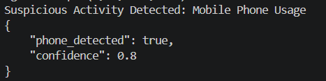

#  Mobile Phone Detection using YOLOv8

## 📌 Project Overview

This project is a module of the **AI Interview Monitoring System**.

The system detects mobile phones visible during online interviews using a pretrained YOLOv8 model and flags phone usage as suspicious activity.

---

## 🎯 Objective

Detect mobile phones during interviews and generate confidence scores.

Phone usage is considered suspicious behavior in online interview monitoring systems.

---

## 🛠️ Technologies Used

* Python
* YOLOv8 (Ultralytics)
* OpenCV
* JSON

---

## ✨ Features

* Detect mobile phones in videos
* Display confidence score
* Draw bounding boxes around detected phones
* Flag suspicious activity
* Generate JSON output

---

## 📂 Project Structure

```text
Mobile_Phone_Detection

│
├── detect_phone.py
├── detect_image.py
├── requirements.txt
├── test_results.md
├── detection_window.png
├── terminal_output.png
└── README.md
```

---

## 🖼️ Detection Output

### Phone Detection Window


### Terminal Output



---

## 📤 Sample Output

```json
{
  "phone_detected": true,
  "confidence": 0.88
}
```

---

## 🧪 Test Result

| Test Case              | Result     |
| ---------------------- | ---------- |
| Phone visible in video | ✅ Detected |
| Confidence displayed   | ✅ Working  |
| Bounding box displayed | ✅ Working  |

---

## 🚀 Future Improvements

* Real-time webcam monitoring
* Risk score integration
* Dashboard integration
* Multi-camera support

---

## 👩‍💻 Author

**Divya Sree**
